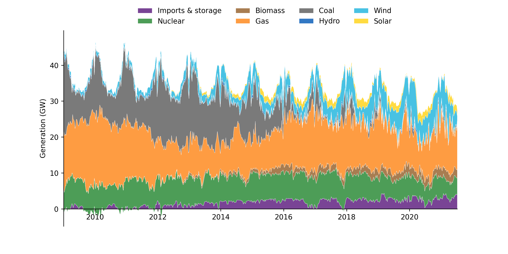
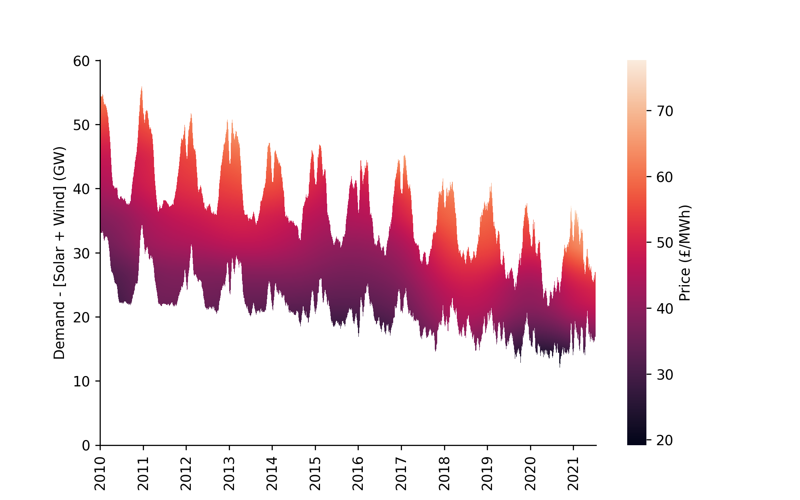

# Visualisations

 

### Measuring the Progress and Impacts of Decarbonising British Electricity

The figures shown here are attempts to replicate the visualisations from [this paper](https://www.sciencedirect.com/science/article/pii/S0301421516307017) by Dr Iain Staffell which finds that:

* CO2 emissions from British electricity have fallen 46% in the three years to June 2016.
* Emissions from imports and biomass are not attributed to electricity, but add 5%.
* Coal capacity fell 50% and output 75% due to prices, competition and legislation.
* Wind, solar and biomass provided 20% of demand in 2015, with a peak of 45%.
* Prices have become more volatile and net demand is falling towards must-run nuclear.

These figures will be updated on a weekly basis, the last update was at: 2021-07-03 13:40

 

#### Weekly Averaged Generation Mix

The following figure shows a stacked plot of the generation from different fuel types over time, averaged on a weekly basis. The original plot can be found [here](https://www.sciencedirect.com/science/article/pii/S0301421516307017#f0030), the following description is taken directly from the paper.

> Over this period fossil fuels have become increasingly squeezed by the growth of imports, biomass, wind and solar. Coal is seen responding to seasonal changes in demand, and displaced gas over the second half of 2011. Gas generation fell steadily from an average of 17.3 GW in 2009–10 to just 9.3 GW in 2012–13. This trend reversed over the course of 2015 with gas generation rising from an average of 9.0 GW in the first quarter of 2015 to 13.8 GW in the first quarter of 2016. By May 2016 coal generation fell to an average of just 1.1 GW, and on the 10th of May instantaneous coal output fell to zero for the first in over 130 years.

 

### Marginal Price Curve Estimation

The figure shown here is reproduced from the work in [this paper](https://ayrtonb.github.io/Merit-Order-Effect/#paper) by Ayrton Bourn which investigates the merit order effect of renewables in the GB and DE power markets in terms of the price and carbon reductions - the key findings are as follows:

* A LOWESS estimation of the non-linear marginal price curve for dispatchable generation shows high back-casting accuracy for Germany and Britain
* The evolving Merit Order Effect (MOE) was estimated through a time-adaptive model, enabling long-term trends to be captured
* In Britain the MOE has increased sharply since 2016, with a 0.67% price reduction per p.p. increase in RES penetration
* Disaggregation of the MOE by fuel-type highlights key differences in the transition paths of Britain and Germany

This figure will be updated on a weekly basis, the last update was at: 2021-07-03 13:45

 

#### Smoothed Price Time-Series Surface

This figure shows the LOWESS (Locally Weighted Scatterplot Smoothing) regressions for the day-ahead marginal price curve visualised as a heatmap surface, highlighting the seasonal and non-cyclical changes over time. A mask has been applied where the residual demand after RES is outside the range of 99% of the data. This view is particularly helpful for picking up long-term trends in the market, for example the higher power prices seen in 18/19 due to high gas prices.

